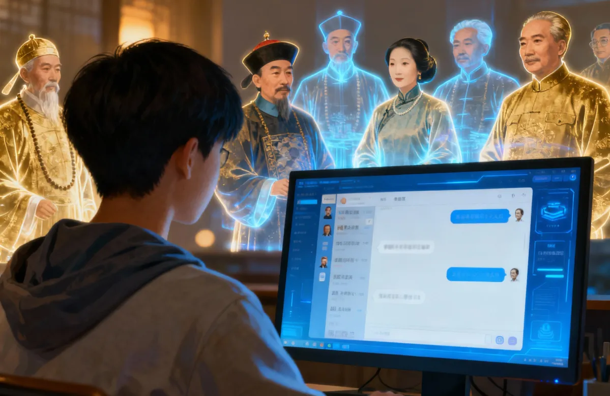

# Historical Figures (HistFig)

HistFig is a lightweight, AI-enhanced chatbot system for simulating conversations with key figures from Chinese history. Leveraging Retrieval-Augmented Generation (RAG), it combines vector search for semantic similarity and BM25 lexical search for keyword matching to ground AI responses in historical documents—speeches, essays, and letters. Implemented in both undergraduate and graduate courses at Lingnan University, HistFig enabled students to converse with AI-simulated personas of Li Hongzhang, Lu Xun, Sun Yat-sen, Qiu Jin, Gu Hongming, Mao Zedong, Deng Xiaoping, and others. The project is educational in nature, with new features being added regularly.

**Links:**
- [GitHub Repository](https://github.com/mcjkurz/histfig/)
- [Blog Post on *The Digital Orientalist*](https://digitalorientalist.com/2025/12/26/voices-from-the-past-retrieval-augmented-dialogues-with-chinese-historical-figures/)

