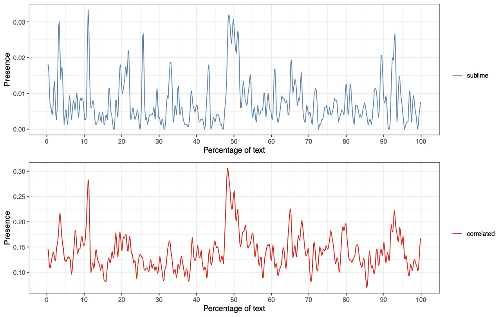

# The Sublime as a Narrative Technology

The sublime can be understood as a narrative technology: a patterned sequence that organizes motion, boundary, and affect into an experience of scale. In modern Chinese fiction, this technology works by accumulating vocabularies of powerful natural phenomena and synchronizing them with plot-specific terms until the narrative arrives at a moment of crossing or release. Computational criticism helps detect these distributed patterns, but the central claim is aesthetic and cognitive: sublime experience is produced through the timed coordination of language, embodiment, and narrative form.

## Publications

### On the Technology of the Sublime in Modern Chinese Narratives

The growing scholarship on the sublime in non-Western contexts makes it necessary to reconsider the possibility of this peculiar experience from a broader cross-cultural perspective. The point of convergence among the many existing interpretations is a diachronic pattern that can be disassembled into three distinct components rooted in embodied experience: rising motion, boundary, and sequentiality. The tools and methods of digital humanities are particularly suitable to detect patterns and repetitions in texts; this paper employs such methods to explore the aesthetic of the sublime in the narrative artifacts of modern China. Combining word embedding, topic modeling, and network analysis, I aim to shed light on what I call the "technology of the sublime," a narrative mechanism that synchronizes plot development with vocabulary distribution in the novel. The first part of this article introduces the computational theory of the sublime to encapsulate the process whereby a steady accumulation of words and expressions describing large and powerful natural phenomena culminates in a boundary-crossing experience narrated in a novel's plot. In the second part, I read two modern Chinese novels—*Second Sun* by Liu Baiyu (1987) and *Soul Mountain* by Gao Xingjian (1990)—and reveal how both authors avail themselves of the narrative mechanism thus defined. The discovered similarity is noteworthy given the ostensibly divergent aesthetics and antagonistic ideals conveyed by the two texts. Finally, I show the ways in which writers negotiate with the sublime meta-narratively to contain and redirect its powerful emotive thrust.

Kurzynski, Maciej. ["On the Technology of the Sublime in Modern Chinese Narratives,"](https://www.dhcn.cn/dhjournal/202201/20434.html) 数字人文 *The Journal of Digital Humanities*, no. 1 (2022): 87-115.

