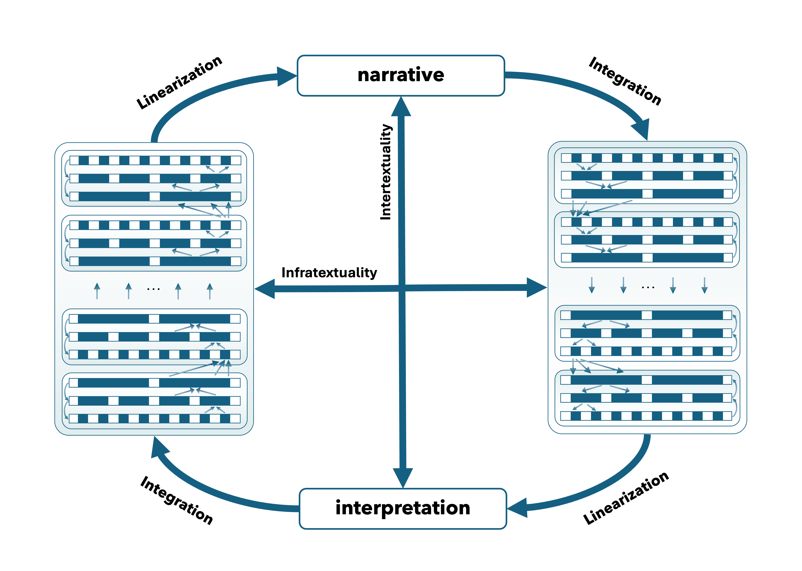

# Techno-Cognitivism

Techno-cognitivism is a framework for studying literature as an interaction among textual form, embodied cognition, historical mediation, and computational modeling. Rather than treating digital methods as external tools applied to stable objects, this project asks how neural, linguistic, and algorithmic models can clarify the layered processes through which literary meaning is produced and received. Its central claim is theoretical: narrative experience unfolds across multiple temporal and cognitive scales, from local sensory-affective cues to broad cultural structures of interpretation.

## Publications

### Neurons and Texts: New Frontiers of Chinese Humanities

The articles gathered in this special issue propose that the study of Chinese literatures and cultures stands to gain from sustained engagement with the computational and cognitive frameworks that are transforming our understanding of how texts and minds interact. The historicist and philological paradigms that have long dominated Sinology are increasingly hard-pressed to explain a world in which literary meaning is processed, modeled, and regenerated by algorithmic systems whose inner workings remain opaque to most humanists but whose elucidation might greatly benefit from humanistic insights. Avoiding both uncritical embrace of technoscience and disciplinary self-enclosure, we pursue an alternative path: a creative integration of quantitative analysis, cognitive science, and network conceptuality with the interpretive power of literary scholarship. The articles cut across periodizations from the classical philosophical canon to Tang regulated poetry to contemporary literature and media, treating meaning not as a property of texts alone but as something that emerges from the interaction of textual surfaces with historically mediated and biologically embodied readers. The recurring figure of the neuron, at once a biological unit, a computational abstraction, and a conceptual metaphor, signals the guiding conviction that the basic unit of these new approaches is neither the isolated data point nor the sovereign interpreter but the connection: between words, bodies, brains, and disciplines.

Kurzynski, Maciej. "Neurons and Texts: New Frontiers of Chinese Humanities," *Prism: Theory and Modern Chinese Literature* 23.1, introduction to special issue, forthcoming.

### Poly-Temporal, Multi-Layered: A Techno-Cognitive Theory of Narrative Experience in Literature

This article draws upon recent developments in cognitive neuroscience and natural language processing to contribute a techno-cognitive perspective to the "deep reading" versus "surface reading" debate in literary studies. Research at the intersection of humanities and sciences suggests that narrative experience, including both production (decoding) and reception (encoding) of stories, constitutes a sequentially and hierarchically complex process shaped simultaneously by socio-cultural contexts, sensory-emotional dynamics, and cognitive integration across multiple levels of complexity. This interdisciplinary view contrasts with traditional humanities methodologies such as area studies, which privileges identity-based accounts of literary phenomena, or Marxist genealogy, which neglects extra-political sources of meaning. The article surveys relevant research findings across multiple domains and discusses the hermeneutic implications of the techno-cognitive approach for literary studies, exemplified in a reading of Zhang Xianliang's 1985 novel *Half of Man is Woman*.

Kurzynski, Maciej. ["Poly-Temporal, Multi-Layered: A Techno-Cognitive Theory of Narrative Experience in Literature"](https://euppublishing.com/doi/full/10.3366/ijhac.2025.0343), *International Journal of Humanities and Arts Computing* (IJHAC) 19, 2025(1), 33-48.

