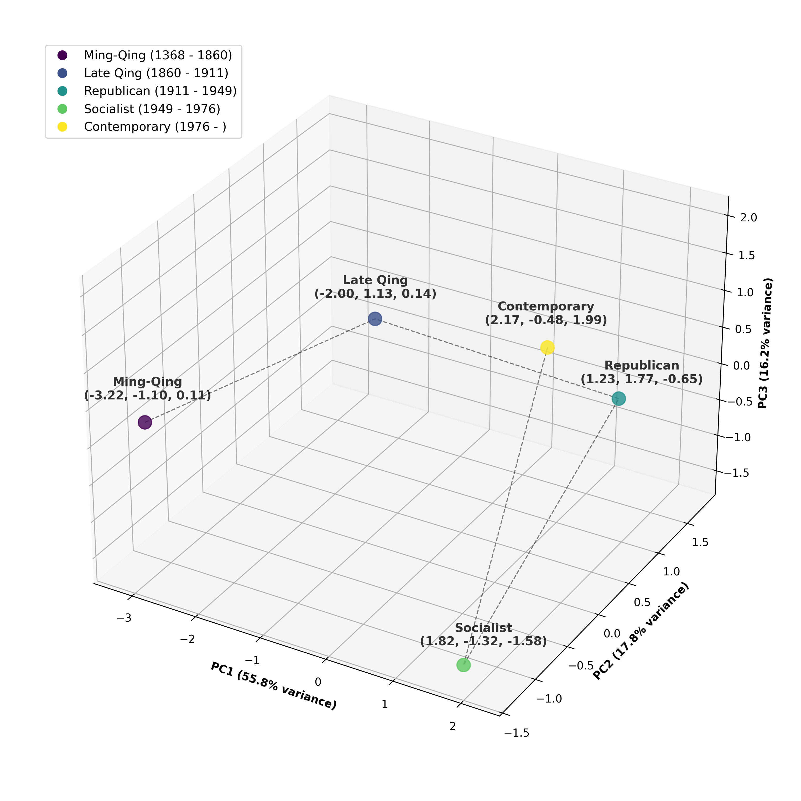

# Words Close to Heart

## Geometries of Empathy from Ming–Qing Fiction to Ye Xin’s *Wasted Years* and Beyond

I argue that Chinese fiction guides narrative empathy by bringing selected social and political realities into proximity with interiority metaphors (e.g., “heart,” “mind,” “liver,” “stomach”). This privileged textual zone operates across three interconnected registers: the surface adjacency of words on the page, the geometric neighborhood of vectors in latent semantic space, and the felt extension of the reader’s body schema into the fictional world. The argument proceeds in two steps. First, a word-embedding model trained on a large corpus of Chinese fiction traces the evolution of interiority metaphors across five historical periods, from the Ming dynasty (1368–1644) to the twenty-first century. As the concept of interiority migrates from epoch to epoch, its vector shifts position in embedding space, revealing the concerns brought closest to the embodied self in each era, such as the “battles of wits” in the Late Qing, revolutionary collectivity in the Socialist period, and the polyphony of everyday life in post-Mao China. Second, a close reading of Ye Xin’s 葉辛 *Wasted Years* 蹉跎歲月 (1980), a representative work of Scar Literature (*shanghen wenxue* 傷痕文學), shows how the novel cues readers to identify with certain characters more than others by allocating “heart-space” unevenly among the sent-down youths, cadre families, and local villagers. By linking computational models of semantic proximity to neurocognitive theories of embodied mind and the poetics of narrative attention, the article contributes to the techno-cognitive framework for the study of empathy in Chinese literatures and cultures.

Kurzynski, Maciej. "Words Close to Heart: Geometries of Empathy from Ming–Qing Fiction to Ye Xin's *Wasted Years* and Beyond," *Prism: Theory and Modern Chinese Literature* 23.1, special issue *Neurons and Texts: New Frontiers of Chinese Humanities*, forthcoming.

